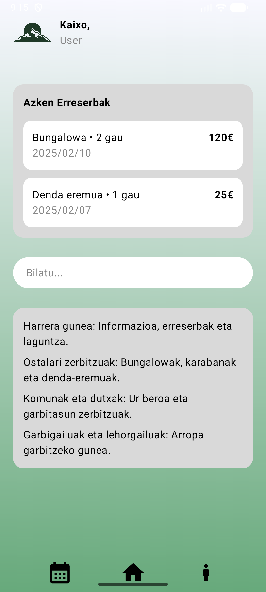
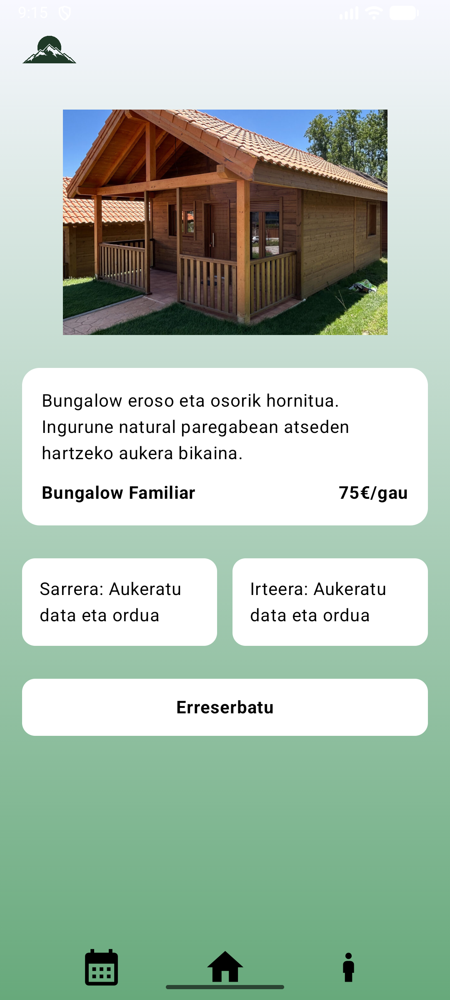
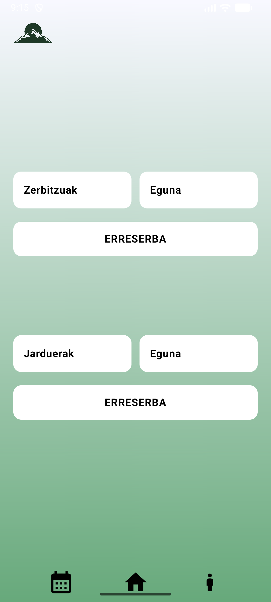

# Arrigorriaga App

Arrigorriaga App Android aplikazio bat da, **Jetpack Compose** erabiliz eraikita. Aplikazio honek erabiltzaileei kanpamentu batean erreserbak egiteko eta informazioa ikusteko aukera ematen die, interfaz intuitibo eta modernoa erabiliz.

---

## Pantailak

### 1. Home pantaila
- Kaixo, User agurra logotipoarekin  
- Azken erreserbak erakusten dituen atala  
- Bilatzailea estilo "Google"  
- Informazio nagusia: Harrera gunea, Ostalari zerbitzuak, Komunak eta dutxak, Garbigailuak  
- Beheko menu nabigagarria: Erreserbak, Home, User

**Pantaila-adibidea:**



---

### 2. Erreserba pantaila
- Logotipoa goian ezkerrean  
- Bungalow edo aukerak erakusten dituen irudi bakarreko karrousel-a  
- Deskribapena, izena eta prezioa  
- Sarrera eta irteera data eta ordurako desplegagarriak  
- Erreserbatu botoia  
- Beheko menu finkoa

**Pantaila-adibidea:**



---

### 3. Zerbitzuak pantaila
- Logotipoa goian ezkerrean  
- Desplegagarriak zerbitzu eta egun aukerak egiteko  
- Jarduerak eta egunak ikusteko beste sekzio bat  
- ERRESERBA botoiak  
- Beheko menu finkoa

**Pantaila-adibidea:**



---

## Teknologiak
- Kotlin  
- Jetpack Compose  
- Android Studio  
- Material3 osagaiak  

---

## Instalazioa

1. Android Studio ireki eta proiektua klonatu:
   ```bash
   git clone https://github.com/salberdic23/Arrigorriaga.git
